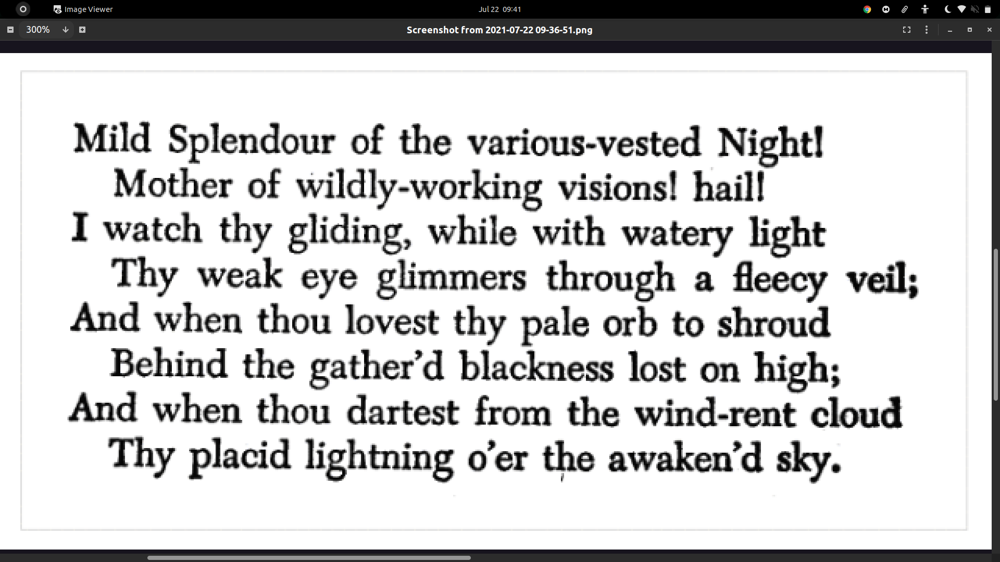

# Image_to_text_website
Convert images to text documents

 INPUT (image file): 
 
 
 
 OUTPUT (text document):
 
  

 
 
 TECHNOLOGIES USED:
 
 Node.js
 
 Multer
 
 Tesseract.js
 
 Express.js
 
 OpenCV
